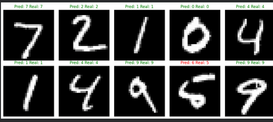
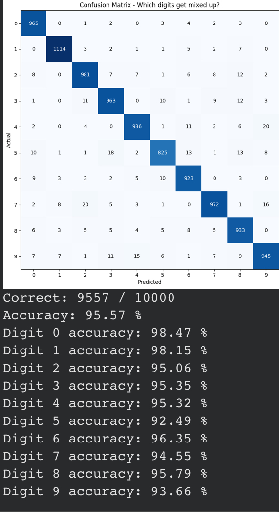

# Neural Network from Scratch + Kaggle Competition

Two approaches to digit recognition — one built from scratch to learn how neural networks work, and one built to compete.

## Part 1: From Scratch (NumPy only)

A neural network that recognizes handwritten digits (0-9), built using only Python and NumPy. No TensorFlow, no PyTorch — every part of the network is written from scratch.

**How it works:**
- **Input layer:** 784 neurons (28x28 pixels flattened)
- **Hidden layer:** 64 neurons with sigmoid activation
- **Output layer:** 10 neurons (one per digit)

The network learns through backpropagation — it makes a prediction, checks how wrong it was, then adjusts its weights to be less wrong next time. After 20 passes through the full dataset, it reaches about 96% accuracy.

**Final accuracy: 95.75%** on test data.

### Predictions on test digits

### Confusion Matrix

The confusion matrix shows where the network struggles. It's decent at most digits but sometimes confuses 4s and 9s (makes sense — they look similar if you write them a certain way).

### What I learned building this

- Forward propagation is just matrix multiplication through each layer
- Backpropagation is really just the chain rule — figure out how much each weight contributed to the error, then nudge it the other direction
- Normalizing inputs to 0-1 instead of 0-255 made a huge difference in training speed
- Small random weights (multiplied by 0.1) train way better than large ones because sigmoid saturates at extreme values
- Batch training (64 images at a time) is faster and more stable than updating after every single image

**Run it:** Open `neural_net_complete.py` in Google Colab or Jupyter Notebook. Takes about 2 minutes to train.

## Part 2: Kaggle Competition — Rank 33, 99.685% accuracy

After understanding how neural networks work from scratch, I entered the [Kaggle Digit Recognizer](https://www.kaggle.com/competitions/digit-recognizer) competition and scored **99.685% accuracy**.

**Techniques used:**
- Ensemble of 5 CNN architectures (ResNet, Deep CNN, Wide CNN, Inception-style, SE-Net)
- Data augmentation (elastic deformation, rotation, shift, zoom, shear)
- Test-Time Augmentation (15 passes averaged per model)
- Pseudo-labeling on high-confidence test predictions
- Cosine annealing learning rate schedule
- Label smoothing and MixUp augmentation

**Run it:** Upload `kaggle_submission.py` to a Kaggle notebook, enable GPU T4 x2, and run. Takes about 2-3 hours.

**Kaggle profile:** [kaggle.com/scottantwi](https://www.kaggle.com/scottantwi)

## The Guide

I wrote a complete guide (`GUIDE.md`) that walks through everything step by step — NumPy basics, the math behind neural networks, and how to build one from scratch.

## Built with

- Python 3
- NumPy (from-scratch version)
- TensorFlow/Keras (competition version)
- Matplotlib (visualization)
- scikit-learn, SciPy (competition augmentation)
